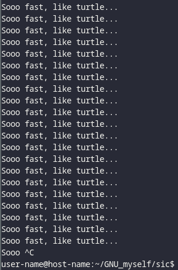

# sic

sic is yet another FOSS implementation of the unix program [yes](
https://en.wikipedia.org/wiki/Yes_(Unix)), written in C that utilizes [write](
https://www.man7.org/linux/man-pages/man2/write.2.html) and buffering to
speed up the bits per second.



## Requirements

- Unix like system (I haven't tested on windows)
- GCC or clang
- GNU make
- unistd, stdio, stdlib, argp and argz (It should be already installed)

## Compiling, running, speedtest and cleaning.
```sh
make                # gcc -o sic src/sic.c -Wall -Wextra
make run            # ./sic Sooo fast, like a turtle
make test_speed     # ./sic | pv > /dev/null
make clean          # rm sic objs/sic.o
```
## Options
- `-h,   --help         → show this help message and exit`
- `-v,   --version      → show program's version number and exit`

## Resources
[Tropetank](https://tropetank.com/reports/TROPE-12-01.pdf)
[Reddit](https://www.reddit.com/r/unix/comments/6gxduc/how_is_gnu_yes_so_fast)
[Ycombinator](https://news.ycombinator.com/item?id=14542938)
[Ycombinator](https://news.ycombinator.com/item?id=31619076)

## Made by [Sivefunc](https://gitlab.com/sivefunc)
## Licensed under [GPLv3](LICENSE)
